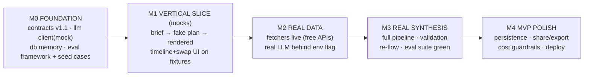

# TravelMate — Implementation Plan

> **Status: FOR REVIEW.** Nothing in this plan is being built until the product owner
> has reviewed and commented. Every section is independently commentable.
>
> Inputs: the vision statement (any trip, any traveler, zero-thinking, swap-everything),
> the six research tracks in [`docs/research/`](./research/README.md), and the existing
> skeleton (every file referenced below already exists as a stub).

---

## 1. What we are building first (MVP definition)

**The capability that must work end-to-end:**

> A user types *any* trip brief in natural language → within ~60–90 s TravelMate
> streams its reasoning, then renders a complete day-by-day itinerary with **real venues,
> real hours, real coordinates, transport between every step, prices, and a SWAP button
> on every option** — and swapping any option visibly re-flows only the dependent blocks.
>
> The architecture must handle any trip type, any traveler, any destination. A brief for
> a motorhome family trip through Germany, a solo backpacker in Southeast Asia, a
> business trip with a free evening, or a group celebrating a birthday — all must
> produce a valid, logistics-realistic, personalized plan without code changes.

**Eval framework — data-driven, not hardcoded:**

Eval cases live as JSON data files in `eval/cases/*.json`. Each file is a trip brief
(free-text string) + a set of minimum assertions the resulting plan must satisfy
(categories that must appear, feasibility constraints, properties that must be present).
The test runner picks up every `*.json` in that directory — add, remove, or replace
cases freely with no code changes.

```
eval/
  cases/
    motorhome-family.json      # campsites, RV logistics, parking — can always be swapped
    nightlife-friends.json     # events, shows, late hours
    culinary-couple.json       # dining depth, multi-city
    city-break-solo.json       # baseline urban trip
    *.json                     # anyone can add more
  runner.ts                   # picks up all *.json, runs pipeline, asserts
```

The seed set ships with a handful of contrasting cases to stress different fetcher
categories and traveler types, but they are **configuration, not code**, and carry no
special status. What enforces universality is that CI must pass for *all registered
cases* and that the pipeline has no branches for specific trip types.

**Explicitly NOT in MVP:** in-app booking (research 6: only 13% want it — deep-links
suffice) · Trip Mode (v2 moat) · group voting · offline mode · mobile app · semantic
LLM cache · affiliate revenue wiring (metadata flows from day one, monetization later).

---

## 2. Decisions adopted from research

| Area | Decision | Doc |
|---|---|---|
| Input UX | Hybrid: free-text brief + auto-extracted editable chips, ≤1 clarifying question, streamed thinking feed, direct-manipulation editing | [R1](./research/01-user-interaction.md) |
| Models | fast=Haiku-class / mid=Sonnet-class / frontier=escalation-only; routing+caching+budgets in `packages/llm`; ~$0.13/plan target | [R2](./research/02-llm-strategy.md) |
| Data | 9 categories; free-API-first (OSM/Overpass, OpenTripMap, Open-Meteo, Nominatim, ORS, Ticketmaster, Duffel-test/Travelpayouts); scrape only priced gaps; affiliates phase 2 | [R3](./research/03-data-sources.md) |
| Presentation | Three altitudes; timeline spine + transport connectors + synced MapLibre map; swap bottom-sheet with visible re-flow diff; buffer rule | [R4](./research/04-itinerary-presentation.md) |
| Format | JSON + zod at every boundary; JSON-Schema at LLM boundary; IDs-in/IDs-out; Postgres jsonb + Redis; REST + SSE | [R5](./research/05-data-formats.md) |
| Priorities | Truth → prices → personalization → logistics realism → swap → one-place; booking = links only | [R6](./research/06-user-capabilities.md) |

---

## 3. Build order — four milestones, three parallel lanes



**Why vertical-slice-first (M1):** the whole product is testable on mocks within days —
UI, contracts, and pipeline shape get validated before a single API key or LLM dollar
is spent. Every later milestone only swaps fakes for real parts.

**Lanes for 3 developers** (matches CODEOWNERS intent; everyone unblocked after M0):

| Lane | Owner | Packages | M1 deliverable |
|---|---|---|---|
| A — Brain | dev A | `orchestrator`, `llm` | pipeline runs on mock LLM + mock fetchers → valid `TripPlan` for any brief |
| B — Data | dev B | `fetchers`, `database` | mock fetchers return realistic fixture data covering diverse trip categories; memory cache + freshness real |
| C — Face | dev C | `apps/web`, `ui`, `apps/api` | brief screen → SSE thinking feed → timeline+map rendering a fixture plan; swap UI |

---

## 4. Per-function implementation plans

### 4.0 `packages/contracts` — v1.1 additions (BLOCKING, do first, ~1 day)

The skeleton contracts are close; research demands these additions:

| Addition | Why (research) |
|---|---|
| `TravelOption.source: { provider; fetchedAt; isEstimate: boolean }` | R6 truth gap: provenance + estimate labelling on every fact |
| `TravelOption.imageUrl?`, `rating?`, `reviewCount?` | R4 cards need sense-of-place |
| `TransportConnector` (per-block `transitTo` summary: mode, minutes, cost) | R4 timeline connectors |
| `ItineraryBlock.bufferMinutes?` | R4 buffer rule |
| `TripBrief.slotConfidence: Record<slot, number>` | R1 chips highlight low-confidence extractions |
| `DayPlan.dayWeather?`, `dailyBudget?` | R4 header/day strips |
| `PlanPatch` (re-flow result: changed block ids + new plan rev) | R4 visible diff |
| `ClarifyingQuestion` (max-one rule encoded in type: `question \| null`) | R1 |

Steps: extend zod schemas → define the `eval/cases/*.json` schema (brief + assertions);
write at least two contrasting fixture cases; confirm both parse → version note in README.
**Done when:** `pnpm test:contracts` green; any well-formed TripPlan and any eval case
file parse without error.

### 4.1 `packages/llm` — the model gateway (lane A, M0–M2)

Build order:
1. `structured.ts` (new): zod schema → JSON-Schema; `completeStructured<T>(stage, schema, prompt)`
   implementing **validate → retry-with-error → escalate tier → hard fail** (R2 §rules).
2. `providers/anthropic.ts`: real SDK call, **prompt-cache blocks** for system+schema+
   destination context; usage accounting incl. cached tokens.
3. `providers/gemini.ts`: same surface (Flash for fast tier).
4. `providers/mock.ts`: returns **golden fixtures keyed by stage** (deterministic, free) —
   this is what M1 runs on.
5. `router.ts`: fill the real model IDs (verify against provider docs at build time),
   stage table per R2.
6. `tokens.ts`: enforce budgets — over-budget throws in test env, warns in prod.

**Done when:** unit tests prove the escalation ladder with a deliberately-failing mock;
token-budget test fails when a prompt fixture exceeds its stage budget; a live
smoke-test script (env-gated, not CI) returns valid JSON from both providers.

### 4.2 `packages/database` — cache, freshness, observer (lane B, M0–M1, M4)

1. `freshness.ts`: implement scoring exactly as designed (linear decay; SWR window);
   keep `DEBUG_FRESHNESS_HOURS` as the only dev knob.
2. `adapters/memory.ts`: complete (incl. `invalidate`, SWR read: return stale + flag
   `needsRevalidation`).
3. `observer.ts`: in-process EventEmitter implementation + an SSE bridge consumable by
   `apps/api` (plan-ready, plan-patched events).
4. `index.ts`: `createDatabase("memory")` real; plans store in-memory map for M1.
5. M4: `adapters/postgres.ts` (jsonb plan documents, drizzle or raw pg) +
   `adapters/redis.ts` (cache). Until then memory is fine — the interface doesn't change.

**Done when:** unit tests cover hit/miss/stale/SWR paths; observer test: savePlan →
subscriber fires once with the parsed plan.

### 4.3 `packages/fetchers` — the data layer (lane B, M1 mocks → M2 real)

Source wiring per R3 (every fetcher: `index.ts` mode-switch · `api.ts` or `scraper.ts` ·
`mock.ts` fixtures · normalizer + zod parse at exit):

| Order | Fetcher | Phase-1 source | Notes |
|---|---|---|---|
| 1 | `places` | Nominatim (geocode) + **ORS matrix** (travel times) | Everything depends on this. Cache aggressively (places don't move). |
| 2 | `weather` | Open-Meteo (no key) | Forecast ≤16 days; climate normals beyond. |
| 3 | `dining` | Overpass (cuisine/hours tags) + OpenTripMap enrich | Tag coverage varies — surface `isEstimate` when hours missing. |
| 4 | `activities` | OpenTripMap (+Wikipedia extracts) + Overpass; OSM `tourism=camp_site` for stays-adjacent RV needs | Includes trails/nature for Black Forest case. |
| 5 | `events` | Ticketmaster Discovery (free key) | Date-windowed; Vegas shows covered. |
| 6 | `flights` | Duffel **test mode** (dev) → Travelpayouts (cached real prices, labelled estimates) | The honest MVP compromise; live shopping = phase 2 affiliate. |
| 7 | `hotels` | Travelpayouts hotels + OSM campsites | Booking scrape only if Travelpayouts coverage disappoints. |

Shared infra first: `http.ts` (fetch wrapper: per-host rate limit, retry/backoff,
timeout, response-fixture recorder for tests).

**Done when (per fetcher):** mock returns ≥8 plausible normalized items for any location
input (parameterized, not city-specific); real mode (env-gated integration test, not CI)
returns ≥5 schema-valid items with provenance for a sample query; recorded fixtures
committed so CI never hits the network.

### 4.4 `packages/orchestrator` — the brain (lane A, M1 mock → M3 real)

1. `intent.ts`: 3-phase extraction (atomic facts → free-form traveler profile →
   inference loop filling nulls with logged assumptions). Outputs `TripBrief` +
   `slotConfidence` + optional single `ClarifyingQuestion`. Stage tier: fast.
2. `planner.ts`: rules-first category selection (e.g. trip mentions motorhome → stays
   includes campsites, ground transport includes RV rental/parking); freshness check
   against db; emit `FetchPlan`; run fetchers **in parallel**; write-through cache.
3. **`preselect.ts` (new file): the quality weapon.** Pure code, no LLM: geo-cluster
   candidates around the chosen stay; filter by opening-hours feasibility for the slot;
   price-tier filter from budget; cap to top-N per category per day (keeps synthesis
   input small AND realistic — R6 logistics-realism demand).
4. `synthesis.ts`: build day skeletons in code (slots + buffer rule), then ONE mid-tier
   structured call: compact candidate summaries in → **option IDs + times + reasoning
   out** → hydrate full records from cache. Stream progress via `onThought`/`onPartialPlan`.
5. `validate.ts` (new): zod + feasibility checks — every block's venue open at its
   scheduled time; inter-block travel time (from ORS matrix) fits the gap; daily cost
   sums within budget tier; every day has ≥breakfast/lunch/dinner. Failures → one retry
   with errors fed back → escalate per R2.
6. `reflow.ts`: dependency graph from `dependencyLogic`; on swap, recompute affected
   blocks from **cached** candidates (re-run preselect around new anchor; fast-tier
   re-rank only if needed); emit `PlanPatch`. **Never re-fetches, never re-runs synthesis.**
7. `pipeline.ts`: wire 1→6; `savePlan()` last; observer notifies.

**Done when:** with mock LLM + mock fetchers, all registered eval cases produce
schema-valid, feasibility-passing plans (CI); with real LLM (env-gated eval script),
≥75% of eval cases pass validation on first or second attempt; re-flow on a hotel
swap touches only proximity-dependent blocks (asserted in test).

### 4.5 `apps/api` — the HTTP host (lane C, M1)

Fastify (lightweight, TS-native). Endpoints:
- `POST /plan` → starts pipeline, returns `{planId}` immediately
- `GET /plan/:id/stream` → **SSE**: `thought` events, `partial` events, `ready` event
- `GET /plan/:id` → current plan JSON
- `POST /plan/:id/modify` → swap request → `PlanPatch` via SSE `patched` event
- zod-validate every body at the boundary; uniform error envelope `{code,message}`.

**Done when:** supertest integration: POST→SSE→GET round-trip works against mock
pipeline; malformed body → 400 with zod details.

### 4.6 `apps/web` + `packages/ui` — the face (lane C, M1 fixtures → M3 live)

Screens (per R1 + R4):
1. **Brief** (`TripDescribe`): textarea + example starters + the 4 auto-filling chips
   (highlight when `slotConfidence` low) + single clarifying-question slot.
2. **Generating**: streamed thinking feed (the inference chain, fetch progress) — the
   trust moment.
3. **Itinerary**: three altitudes — trip header (cost bar, weather strip, bookings
   checklist) · day timeline with block cards + transport connectors · synced
   **MapLibre+OSM** map (split view desktop, sheet mobile) · block detail expand ·
   **SWAP bottom-sheet** (alternatives + reasoning) · re-flow diff highlight on patch.

State: plan comes ONLY from `GET /plan` + SSE events (the no-onComplete rule). Build
components in `packages/ui` (RN-safe), pages in `apps/web`.

**Done when:** Playwright e2e (CI, mocked api): type brief → see thinking → itinerary
renders fixture → swap a block → only dependent cards re-render. Lighthouse mobile
pass on the itinerary page.

### 4.7 `packages/trip-mode` — deferred (v2)

Unchanged skeleton. Planned after MVP review: scheduler from approved plan, state
machine, notification dispatch, disruption re-flow (the R6 #10 moat). Not estimated here.

---

## 5. Testing & CI growth per milestone

| Milestone | Gates added to CI |
|---|---|
| M0 | contract tests for v1.1 schemas + eval case schema (already: typecheck+test) |
| M1 | orchestrator eval-suite tests (mock LLM, all `eval/cases/*.json`); ESLint flat configs land → **lint job re-enabled** incl. boundary rules; ui component tests |
| M2 | fetcher normalizer tests on recorded fixtures (no live calls in CI); token-budget asserts |
| M3 | full-pipeline eval runner on all registered eval cases (mock LLM in CI; real-LLM eval script run manually pre-release); **Playwright e2e job re-enabled** |
| M4 | postgres/redis adapter tests (service containers); deploy smoke test |

Live-API/LLM tests are always env-gated scripts — CI stays free, fast, deterministic.

## 6. Accounts & keys needed (create before M2)

| Service | For | Cost |
|---|---|---|
| Anthropic API | mid/fast tiers | pay-as-you-go (~$0.13/plan) |
| Google AI (Gemini) | alternate fast tier | free tier likely sufficient |
| Duffel | flights (test mode) | free sandbox |
| Travelpayouts | flights/hotels cached prices | free affiliate signup |
| Ticketmaster Discovery | events | free key |
| OpenTripMap | activities | free key |
| openrouteservice | travel-time matrix | free key (rate-limited) |
| Open-Meteo, Nominatim, Overpass | weather/geo/POI | free, no key (respect rate limits) |

## 7. Top risks & mitigations

| Risk | Mitigation |
|---|---|
| OSM data gaps (hours/cuisine missing in some cities) | `isEstimate` labelling; OpenTripMap/Wikipedia enrichment; Google Places as paid fallback decision point at M2 review |
| LLM JSON validity at synthesis scale | structured-output mode + validate-retry-escalate + IDs-only output (small surface) |
| Free-API rate limits during dev | aggressive caching (the Database tier is built for exactly this); recorded fixtures for tests |
| Travelpayouts price staleness | label as estimate + "check live price" deep-link (which is also the affiliate click — aligned incentives) |
| Scope creep (the #1 MVP killer per research) | this document; anything not in §1 needs an explicit decision |

## 8. Open questions for the product owner (answer in review)

1. **Flights honesty trade-off:** OK to ship MVP with Duffel-sandbox/cached-price
   estimates clearly labelled, with live prices arriving in phase 2 via affiliate APIs?
2. **Map:** MapLibre+OSM (free) for MVP confirmed, or is Google Maps accuracy worth
   the key/cost from day one?
3. **Auth/accounts in MVP?** Plan assumes **no login** for MVP (plan URL = access);
   accounts arrive with persistence in M4+. Acceptable?
4. **Budget currency/locale:** default EUR or USD display?
5. **Hosting target** for the M4 deploy (Vercel + small VM? fly.io? your call shapes
   the api host details).
6. Eval seed: what trip types should be in the initial `eval/cases/` seed to stress the widest range of categories? (The framework accepts any brief — this is just deciding what to start with before the first real run.)

---

*Once you've commented and we've locked §1, §3 and the open questions, building starts
at M0 — and every milestone ends with a demo against the golden-trip set.*
