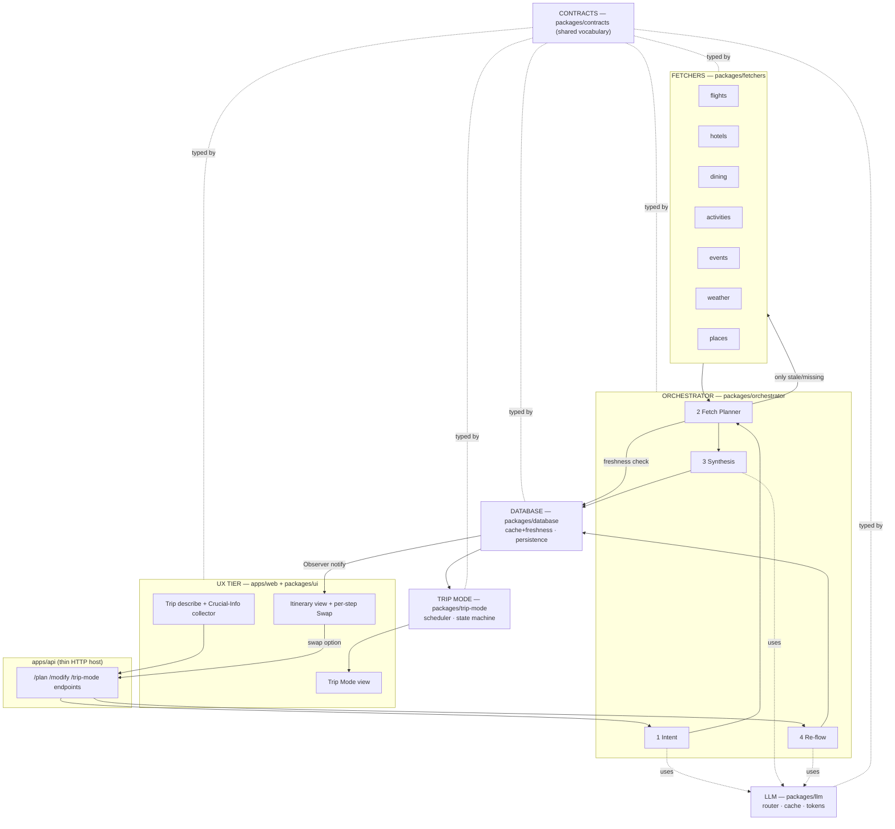
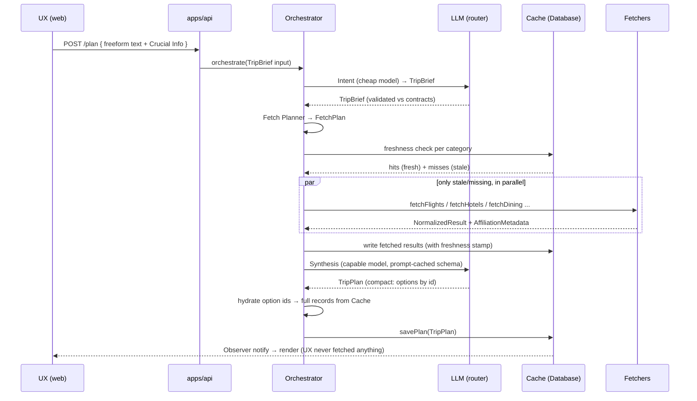
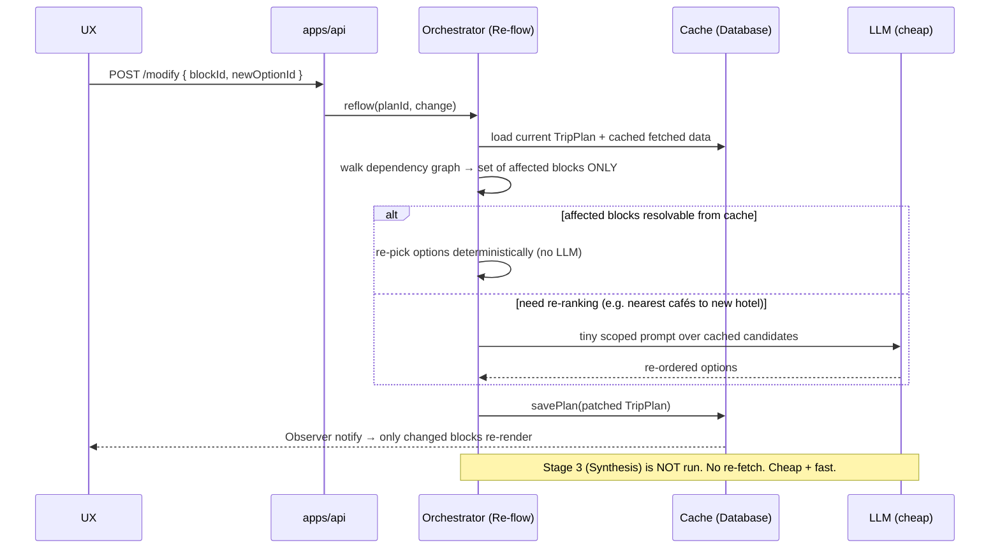
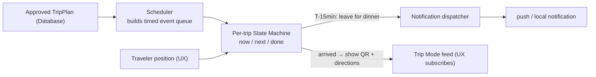

# projectStructure.md — How TravelMate Is Built

> The architecture passport. Read `about_travelMate.md` first (the *what/why*),
> then this (the *how*). If anything here conflicts with `about_travelMate.md`,
> `about_travelMate.md` wins and this file is the bug.
>
> **Reading guide:** §1 the map · §2 the tier model + why we improved your 4-function
> idea · §3 diagrams · §4 the contracts (how tiers talk) · §5 data & freshness ·
> §6 fetchers (scrape→API swap) · §7 LLM model + token strategy · §8 testing ·
> §9 how the team works in parallel · §10 stack & decisions.

---

## 1. The map — every folder, one line

```
travelMate/
├── about_travelMate.md      ← product definition (read first)
├── projectStructure.md      ← this file
├── apps/
│   ├── web/                 UX TIER (web). Next.js. Renders & edits the plan. Zero business logic.
│   ├── mobile/              UX TIER (mobile). Reserved for Expo/React Native. Empty by design (web-first).
│   └── api/                 Backend host. Exposes Orchestrator + Trip Mode over HTTP. No logic of its own.
├── packages/
│   ├── contracts/           SHARED. The ONLY cross-tier vocabulary: types + zod schemas. Everyone imports this.
│   ├── orchestrator/        ORCHESTRATOR TIER. Intent → fetch-plan → synthesis → re-flow. The brain.
│   ├── fetchers/            FETCHERS TIER. One module per data type. Scrapers now, APIs later. Normalised output.
│   ├── database/            DATABASE TIER. Cache store + freshness scoring + persistence (users/saved trips).
│   ├── llm/                 LLM abstraction. Provider-agnostic, model router, token utilities, semantic cache.
│   ├── trip-mode/           TRIP MODE engine. Live next-step state machine + notification scheduler.
│   ├── ui/                  Shared presentational components (web now; RN-safe primitives later).
│   └── config/              Shared tsconfig / eslint / prettier / vitest presets. No runtime code.
├── tooling/                 Repo scripts (contract check, codegen). Not shipped.
├── docs/adr/                Architecture Decision Records — one file per irreversible decision.
├── .github/                 CI workflows, CODEOWNERS, PR/issue templates.
├── turbo.json               Task graph + caching for the monorepo.
├── pnpm-workspace.yaml      Declares the workspace packages.
└── tsconfig.base.json       The TS config every package extends.
```

**Mental model:** `apps/*` are thin shells. All real logic lives in `packages/*`, one
package per tier, and **every arrow between tiers is a type in `packages/contracts`**.
That single rule is what lets three people build in parallel without colliding.

---

## 2. The tier model — and a deep look at your 4-function idea

You proposed four functions: **UX**, **Orchestrator**, **Fetchers**, **Database**. That
separation is correct and we keep it. After researching production AI-travel-agent
architectures, here is where we **refine** it. Each refinement is justified, not
decoration.

### Your 4 functions — kept as-is

| Your function | Our package | Responsibility |
|---|---|---|
| **UX** | `apps/web` (+ `packages/ui`) | Collect the trip/traveler description; render the itinerary; let the user swap any step. **Reads from Database only. Never fetches, never calls the LLM.** |
| **Orchestrator** | `packages/orchestrator` | Turn user input into a plan: understand intent, decide what data is needed, call fetchers, synthesise the itinerary, hand it to the Database. |
| **Fetchers** | `packages/fetchers` | Specialised data getters — one per category. Scraping first, affiliate APIs later. |
| **Database** | `packages/database` | Cache fetched data with a freshness score; re-fetch when stale; also persist users & saved trips. |

### Refinement 1 — the Orchestrator is **one tier with four explicit stages**

Your description ("AI converts input → prompt → understand what to fetch → call
fetchers → assemble → pass to UX") is exactly right, but collapsing it into one function
makes Highlight **H4 (live editing)** impossible to do cheaply. We split it into four
named stages inside the one package:

1. **Intent** (`intent.ts`) — free-form user text → structured, validated `TripBrief`
   (traveler profile in natural language + atomic facts + inferred defaults). LLM call.
2. **Fetch Planner** (`planner.ts`) — `TripBrief` → a `FetchPlan`: which fetchers, which
   parameters, what freshness each category needs. Checks the Database *first*; only
   stale/missing categories are fetched. Mostly deterministic + light LLM/tool-calling.
3. **Synthesis** (`synthesis.ts`) — fetched + cached data → the `TripPlan` (the
   zero-thinking itinerary). The one expensive LLM call.
4. **Re-flow** (`reflow.ts`) — given an edited block, recompute **only its dependents**
   using *already-cached* data. Tiny, cheap LLM call (often none). **This is why the
   split exists:** H4 must not re-run stage 3.

**Why this matters:** editing the hotel must not re-fetch flights or re-synthesise the
whole week. Separating "fetch" from "synthesise" from "re-flow" turns a $$$ full
regeneration into a ¢ scoped patch. This is the single most important architectural
decision in the project.

### Refinement 2 — `contracts` is promoted to a first-class tier

You said the interface between functions must be well-defined so the team can work in
parallel. We make that mechanical, not aspirational: a dedicated `packages/contracts`
package holds **every** inter-tier type as a TypeScript type **and** a runtime `zod`
schema. Tiers do not import each other — they import `contracts`. Changing a contract is
a deliberate, reviewed act (it has its own CODEOWNERS line). See §4 and §9.

### Refinement 3 — the Database tier has **two stores**, not one

Your "database function" actually has two different jobs with different lifetimes:

- **Cache store** — short-lived, freshness-scored, per-category fetched data. Keyed by
  a normalised query hash. Backed by Redis in production, in-memory for tests.
- **Persistence store** — long-lived: user accounts, saved/approved trips, Trip-Mode
  progress. Backed by Postgres.

Conflating them (one store, one TTL) is a known trap. We keep one package
(`packages/database`) exposing two clearly separated interfaces.

### Refinement 4 — Trip Mode is its own subsystem

Highlight **H5** (the live in-trip companion) is not "more UX" and not "more
Orchestrator" — it is a time-driven state machine over an *approved* plan. It gets its
own package, `packages/trip-mode`: a scheduler + a per-trip state machine + a
notification dispatcher. It reads the approved plan from the Database and emits
`TripModeEvent`s the UX subscribes to.

### Refinement 5 — LLM access is abstracted, never called directly

Every tier that needs a model calls `packages/llm`, never a vendor SDK. That package
owns provider selection, the **model router/cascade**, prompt caching, token accounting,
and a semantic response cache. This is what makes §7 (cost control) enforceable in one
place instead of scattered across the codebase.

### The improved tier list

```
UX (apps/web, packages/ui)
   └─ reads ──────────────► DATABASE (cache + persistence)
ORCHESTRATOR (packages/orchestrator: intent│planner│synthesis│reflow)
   ├─ uses ───────────────► LLM (packages/llm: router, cache, tokens)
   ├─ calls ──────────────► FETCHERS (packages/fetchers: per-category, normalised)
   └─ writes ─────────────► DATABASE
TRIP MODE (packages/trip-mode) ── reads ─► DATABASE ── emits ─► UX
ALL TIERS ── speak only ──► CONTRACTS (packages/contracts)
```

### Import boundary matrix (enforced by lint + CI — see §9)

| Package | May import | Must NEVER import |
|---|---|---|
| `apps/web`, `packages/ui` | `contracts`, `database` (read), `trip-mode` (subscribe) | `orchestrator`, `fetchers`, `llm` |
| `packages/orchestrator` | `contracts`, `fetchers`, `database`, `llm` | `apps/*`, `ui` |
| `packages/fetchers` | `contracts`, `llm` (optional, for parsing) | `orchestrator`, `database`, `apps/*`, `ui` |
| `packages/database` | `contracts` | everything else |
| `packages/trip-mode` | `contracts`, `database` | `apps/*`, `orchestrator`, `fetchers` |
| `packages/llm` | `contracts` | everything else |
| `packages/contracts` | nothing (leaf) | everything |

---

## 3. Diagrams

### 3.1 Component overview



### 3.2 Plan-a-trip sequence



### 3.3 Live edit / re-flow sequence (Highlight H4)



### 3.4 Trip Mode (Highlight H5)



---

## 4. The contracts — how tiers talk (the parallel-work enabler)

`packages/contracts` is the heart of the parallel-development strategy. It exports, for
every inter-tier message, **a TS type and a matching `zod` schema** so every boundary is
validated at runtime, not just at compile time.

| Contract | Direction | Meaning |
|---|---|---|
| `CrucialInfo` | UX → Orchestrator | The minimum validated fields (destination, traveler description, trip type, budget tier). |
| `TripBrief` | Orchestrator-internal output of Intent | Atomic facts + free-form `travelerProfile` + `inferenceChain` (logged assumptions) + needed categories. |
| `FetchPlan` | Orchestrator-internal (Planner→Fetchers) | Per-category fetch requests + required freshness. |
| `FetchRequest<C>` / `NormalizedResult<C>` | Orchestrator ↔ Fetchers | The single shape every fetcher takes and returns, regardless of source. Carries `AffiliationMetadata`. |
| `AffiliationMetadata` | Fetchers → everything | `{ trackingId, referralSource, campaignId, conversionType }` — present on every fetched record (monetization, P-future). |
| `CacheEntry<T>` / `FreshnessPolicy` | Database ↔ Orchestrator | Stored value + when fetched + freshness score + policy used to decide re-fetch. |
| `TripPlan` → `DayPlan` → `ItineraryBlock` → `TravelOption` | Orchestrator → Database → UX | The zero-thinking itinerary. Blocks carry `dependencyLogic` so Re-flow knows the graph. |
| `LLMRequest` / `LLMResponse` / `ModelTier` | any tier → LLM | Provider-agnostic call + which capability tier was used + token accounting. |
| `TripModeEvent` | Trip-Mode → UX | A timed instruction in the live feed (`next`, `leaveNow`, `showTicket`, …). |
| `StreamCallbacks` | Orchestrator → UX | `onThought`, `onPartialPlan`, `onError`. **No `onComplete`** — UX learns of completion via the Database Observer, never a callback. |

**The rule:** if a value crosses a package boundary, its type lives here and its zod
schema is asserted at the boundary. A tier that changes its output without changing the
contract will fail the other tiers' **contract tests** (§8) in CI before it can merge.

---

## 5. Data flow & the freshness model

### Unidirectional flow (never reversed)

```
1. UX → Orchestrator        CrucialInfo (validated by zod at the boundary)
2. Orchestrator → Database  freshness check per category
3. Orchestrator (internal)  Intent → Fetch Planner
4. Orchestrator → Fetchers  ONLY stale/missing categories, in parallel
5. Orchestrator → Database  write fetched results + freshness stamp
6. Orchestrator → LLM       Synthesis → TripPlan
7. Orchestrator → Database  savePlan()  ← always the last write
8. Database → UX            Observer notify → render
```

### Freshness score (the core of your "freshness expires → re-fetch" idea)

Each `CacheEntry` stores `fetchedAt`, the `category`, and the `FreshnessPolicy` it was
fetched under. On read, the Database computes a **freshness score ∈ [0,1]** and the
Fetch Planner compares it to the category's `minFreshness`:

| Category | Typical volatility | Strategy |
|---|---|---|
| Flights / live prices | minutes–hours | low max-age, **stale-while-revalidate**: serve cached instantly, refresh in background |
| Hotels / availability | hours | SWR, medium max-age |
| Dining / activities / places | days–weeks | long max-age (hours/days), opportunistic refresh |
| Weather (forecast) | hours | refresh if trip date within forecast window |
| Events | days, but date-sensitive | refresh as event date approaches |

> **Single knob during development:** all categories use one `DEBUG_FRESHNESS_HOURS`
> constant in `packages/database`. Per-category production policies are switched on
> deliberately by the team (it changes cost/latency), never silently. This decision is
> recorded as an ADR.

**Stale-while-revalidate** is the default pattern: the UX gets an instant plan from
cache while the Orchestrator refreshes volatile categories in the background and the
Database re-notifies. (Sourced from web.dev / MDN SWR guidance — see Sources.)

---

## 6. Fetchers — scrape now, swap to APIs later without touching the Orchestrator

This realises Highlight **H1** and Principle **P7**.

```
packages/fetchers/src/
├── index.ts          Fetcher registry + the Fetcher<C> interface
├── normalizer.ts     Source-specific raw shape → contracts.NormalizedResult
├── affiliation.ts    Stamps AffiliationMetadata on every record
├── flights/   { index.ts (Fetcher), scraper.ts, mock.ts }
├── hotels/     { index.ts, scraper.ts, mock.ts }
├── dining/     { index.ts, scraper.ts, mock.ts }
├── activities/ { index.ts, scraper.ts, mock.ts }
├── events/     { index.ts, scraper.ts, mock.ts }
├── weather/    { index.ts, scraper.ts, mock.ts }
└── places/     { index.ts, scraper.ts, mock.ts }   (geocoding, transit, distances)
```

Every fetcher implements the **same** interface:

```ts
interface Fetcher<C extends Category> {
  category: C
  fetch(req: FetchRequest<C>): Promise<NormalizedResult<C>>   // throws FetcherError
}
```

- **Today:** `scraper.ts` uses Playwright (one tool, also our E2E engine — see §8).
  Scraping is logged-out, public-data only, robots.txt + ToS respected, rate-limited and
  cached aggressively (legal/ethical guidance in Sources). The Orchestrator only ever
  sees `NormalizedResult` — it cannot tell scraping from an API.
- **Later:** add `amadeus.ts`, `skyscanner.ts`, `booking.ts`, `viator.ts`, etc. behind
  the *same* interface. The Orchestrator does not change. Affiliate IDs flow through
  `affiliation.ts` (Skyscanner/Booking/Travelpayouts are affiliate-model — Sources).
- **Always:** `mock.ts` returns deterministic fixtures so the Orchestrator and UX can be
  built and tested with **zero** network/cost. The registry picks `mock | scraper | api`
  by env.

A candidate source map for the later API phase (from the research) lives in
`docs/adr/0002-data-sources.md` (Amadeus/Duffel/Skyscanner flights; Hotelbeds/Expedia
Rapid/Booking hotels; OpenTable dining; Viator/GetYourGuide/Tiqets activities;
Ticketmaster events; TripAdvisor reviews; HERE/Moovit transit).

---

## 7. LLM strategy — model selection & token optimization (your explicit question)

> You asked: *how do I optimize token usage, and which models for every LLM access?*
> This is a first-class design pillar, owned entirely by `packages/llm` so the policy
> lives in one enforceable place.

### 7.1 Provider-agnostic by design

`packages/llm` exposes one `LLMClient`. Vendors sit behind `providers/{anthropic,
gemini,mock}.ts`. We default to **Anthropic Claude** (research: Sonnet-class models give
near-flagship quality at mid pricing with strong tool-use; Haiku-class is the cheap/fast
workhorse), with **Gemini Flash** wired in as the cheapest high-volume option. Swapping
providers is a config change, never a code change in other tiers.

### 7.2 Model routing — one cascade, by stage

Each Orchestrator stage declares the **cheapest capable tier** and escalates only on a
*validated* failure (schema/zod mismatch, low confidence). Research shows this routing
pattern alone cuts 50–80% of LLM spend.

| Stage | Default tier | Escalates to | Why |
|---|---|---|---|
| **Intent** | Small/fast (Haiku-class or Gemini Flash) | Mid | Short input, strict JSON; small model is plenty. |
| **Fetch Planner** | Small/fast + tool-calling | Mid | Mostly deterministic; LLM only disambiguates. |
| **Synthesis** | Mid/capable (Sonnet-class) | Frontier (Opus-class) **only** after 2 failed validations | The hard, long, structured plan. Mid-tier ≈ flagship quality at a fraction of cost. |
| **Re-flow** | Small/fast | Mid | Tiny scoped diff over cached candidates; often **no LLM at all**. |
| **Contextual Q&A** | Small/fast | Mid | "What's the visa rule?" — short, factual. |

### 7.3 Token optimization techniques (all enforced in `packages/llm`)

1. **Prompt caching.** The big static system prompt + the universal JSON schema +
   stable destination context are sent as cached blocks. Research: ~90% cost reduction
   on repeated input — and Synthesis re-sends the same large schema every call. Biggest
   single saver.
2. **Decompose, don't mega-prompt.** Intent/Planner/Re-flow use small focused prompts.
   Only Synthesis carries the large context. Avoids paying frontier-size context on
   trivial steps.
3. **IDs in, IDs out — hydrate in code.** Fetched records are stored in the Cache; the
   LLM is given **compact summaries** and returns **option IDs**, not full records.
   Code re-hydrates full data from the Cache after the call. This keeps the most
   expensive prompt (Synthesis) an order of magnitude smaller and removes a whole class
   of hallucination.
4. **Cheapest-model cascade** (§7.2) — escalate only on validated failure.
5. **System-prompt hygiene.** System prompts are linted for size; research flags prompt
   bloat as the #1 silent cost leak. A budget is asserted in tests.
6. **Semantic response cache.** LLM outputs are cached keyed by a normalised
   intent/plan hash; near-identical briefs reuse a prior synthesis instead of paying
   again.
7. **Scoped re-flow over regenerate** (Refinement 1). The H4 edit path never re-runs
   Synthesis — the largest structural token saving in the product.
8. **Batch API for non-interactive work.** Background re-synthesis / pre-warming uses
   the provider batch tier (~50% discount); only the interactive path pays full rate.
9. **Stream to hide latency.** Synthesis streams `onThought` + partial plan to the UX
   so perceived latency is low without spending more tokens (research: staircase
   streaming cuts perceived latency dramatically).
10. **Token accounting is a test.** Every stage has a token-budget assertion in CI; a
    prompt change that blows the budget fails the build, not the invoice.

### 7.4 Where model IDs live

Exactly one file: `packages/llm/src/router.ts` (the model cascade table). No model ID
appears anywhere else — not in fetchers, not in tests, not in app code. Changing a model
is a one-file, ADR-recorded change.

---

## 8. Testing infrastructure (so every change is verifiable)

The brief asks for test infra "so we can test the codebase after every code change."
The design goal: **a change in one package proves itself without running the others.**

### Tooling

| Layer | Tool | Scope |
|---|---|---|
| Unit + integration | **Vitest** | Every package. TS-native, fast, watch mode. Colocated `*.test.ts`. |
| Contract tests | **Vitest + zod** | Each tier asserts its inputs/outputs parse against `packages/contracts` schemas. |
| E2E (web) | **Playwright** | `apps/web` happy paths. Same engine as the scrapers — one tool to learn. |
| Type safety | **tsc --noEmit** | `turbo run typecheck` across the graph. |
| Lint + boundaries | **ESLint** (+ `eslint-plugin-boundaries`) | Enforces the §2 import matrix — a cross-tier import fails CI. |
| Orchestration | **Turborepo** | `turbo run lint typecheck test build` — cached, only changed packages re-run. |

### The contract test — why parallel work is safe

Every tier ships a `__tests__/contract.test.ts` that feeds fixtures through its public
entrypoint and asserts the result `zod`-parses against the shared schema. Consequence:
if the Fetchers team changes an output shape, the Orchestrator's contract test goes red
**in CI on their PR** — they find out immediately, not three days later in an
integration branch. The contract package is the tripwire.

### Mocks make tiers independent

- `packages/fetchers/**/mock.ts` — deterministic fixtures; Orchestrator/UX develop with
  zero network and zero scraping.
- `packages/llm/src/providers/mock.ts` — deterministic, **zero-cost, zero-network** LLM;
  Synthesis/Re-flow are tested without spending a cent or hitting a rate limit.
- `packages/database` in-memory adapter — no Redis/Postgres needed for unit tests.

### CI (`.github/workflows/ci.yml`)

On every PR: install → `turbo run typecheck lint test build` (cached) → contract tests →
Playwright E2E on `apps/web`. Green required to merge to `main`. Per-tier token-budget
and prompt-size assertions run inside `test`.

### Local loop

`pnpm test` (all), `pnpm --filter @travelmate/orchestrator test` (one tier),
`pnpm test:contracts` (just the boundaries), `turbo run build` (verify the graph).

---

## 9. How three people work in parallel without colliding

This is the operational point of the whole structure.

1. **One tier per package, one owner per tier.** `.github/CODEOWNERS` (created empty —
   the team fills in handles) maps each `packages/*` to its owner so PRs auto-route.
2. **`packages/contracts` is co-owned and change-gated.** Editing it requires review
   from every tier owner — because it is the only thing that can break someone else.
3. **You only need contracts + mocks to build your tier.** The Orchestrator dev uses
   fetcher mocks + the mock LLM. The UX dev uses a seeded Database + a fixture plan.
   The Fetchers dev never opens the UX. Nobody is blocked on anybody.
4. **The import matrix is mechanically enforced** (ESLint boundaries + CI), so an
   accidental cross-tier import is impossible to merge.
5. **Contract tests are the integration contract.** If your tier is green against the
   contracts, you are by definition compatible with everyone else's green tier.
6. **ADRs record irreversible decisions** (`docs/adr/`) so choices don't get
   re-litigated each session or each new teammate.

---

## 10. Stack & key decisions

| Concern | Choice | Rationale |
|---|---|---|
| Language | TypeScript everywhere | One language across UX/Orchestrator/Fetchers/DB; shared types via `contracts`. |
| Monorepo | pnpm workspaces + Turborepo | Research-backed 2026 default; cached task graph; only-changed rebuilds. |
| Web (UX) | Next.js (App Router) | Mature React; SSR for fast first plan render; easy API host. |
| Mobile (UX) | Reserved `apps/mobile` (Expo) | "Web-first, mobile-ready" — shared `contracts`/`ui` mean it drops in later with no refactor. |
| Backend host | `apps/api` (thin) | Hosts Orchestrator + Trip Mode over HTTP. Logic stays in packages, host stays swappable. |
| Scraping/E2E | Playwright | Doubles as fetcher engine **and** web E2E — one dependency, two jobs. |
| Cache store | Redis (prod) / memory (test) | Fast freshness-scored cache; SWR-friendly. |
| Persistence | Postgres | Users, saved trips, Trip-Mode state. |
| LLM | Provider-agnostic; Anthropic default, Gemini wired | Quality/cost per §7; swappable by config. |
| Validation | zod at every tier boundary | Compile-time *and* runtime safety; powers contract tests. |

> Nothing in `apps/*` is built yet — these are skeletons (interfaces + stubs that throw
> `NotImplemented`). This document + `about_travelMate.md` are the source of truth; code
> follows them, not the reverse.

---

## Sources

- [LLM API Cost Comparison 2026 — Zen van Riel](https://zenvanriel.com/ai-engineer-blog/llm-api-cost-comparison-2026/)
- [2026 LLM Application Cost Optimization Handbook — XiDao](https://blog.xidao.online/en/posts/2026-llm-cost-optimization-handbook/)
- [Claude Model Selection Guide — SitePoint](https://www.sitepoint.com/claude-model-selection-framework/)
- [Building Production-Grade AI Travel Agents in 2026 — Hitreader](https://www.hitreader.com/building-production-grade-ai-travel-agents-in-2026-a-step-by-step-guide-to-langchain-scalable-architectures-and-real-world-deployment/)
- [How to Build an AI Travel Agent — Anadea](https://anadea.info/blog/how-to-build-ai-travel-agent/)
- [Aimpoint Digital AI Agent Systems — Databricks](https://www.databricks.com/blog/aimpoint-digital-ai-agent-systems)
- [Vaiage: Multi-Agent Travel Planning — arXiv 2505.10922](https://arxiv.org/abs/2505.10922)
- [Staircase Streaming for Low-Latency Multi-Agent Inference — arXiv 2510.05059](https://arxiv.org/pdf/2510.05059)
- [Monorepos with TypeScript in 2026: Turborepo & pnpm — Medium](https://medium.com/@mernstackdevbykevin/monorepos-with-typescript-93c9233f6df8)
- [Work with monorepos — Expo Documentation](https://docs.expo.dev/guides/monorepos/)
- [Keeping things fresh with stale-while-revalidate — web.dev](https://web.dev/articles/stale-while-revalidate)
- [Cache-Control header — MDN](https://developer.mozilla.org/en-US/docs/Web/HTTP/Reference/Headers/Cache-Control)
- [Playwright Web Scraping (ethical guide) — ScreenshotAPI](https://www.screenshotapi.net/blog/web-scraping-with-playwright-a-complete-ethical-and-scalable-guide)
- [Is Web Scraping Legal? — Decodo](https://decodo.com/blog/is-web-scraping-legal)
- [Travel and Booking APIs — AltexSoft](https://www.altexsoft.com/blog/travel-and-booking-apis-for-online-travel-and-tourism-service-providers/)
- [Top 14 Travel APIs for Developers (2026) — API.market](https://api.market/blog/magicapi/travel-api/best-travel-apis-for-developers)
